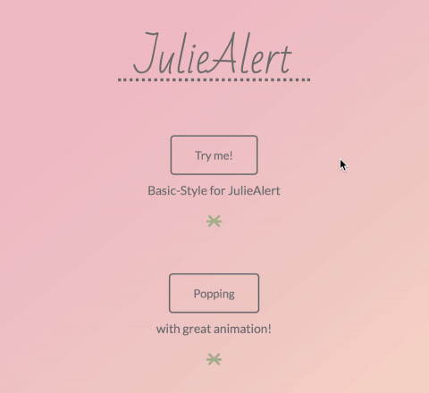

# JulieAlert

All you need is ``julie``
---
JulieAlert let you display Javascript`s alert function with beautiful custom style. 


## Setup
---
download the package and reference the JavaScript and CSS files manually:
<pre><code>  &lt;script src="assets/juliealert.min.js"&gt;&lt;script&gt;
  &lt;link href="assets/juliealert.min.css" rel="stylesheet" &gt;
</code></pre>

##Example

using jquery to control ```julie``` function:

Basic style:
<pre><code>$('button').click(function(){
  Julie({
    title: "Julie!",
    text: "Basic style!",
    confirmText: "ok",
    errorText:"",
    Pop:false,
  });
});
</code></pre>


With confirm & error button:
<pre><code>$('button').click(function(){
  Julie({
    title: "Julie!",
    text: "do it!",
    confirmText: "ok",
    errorText:"nope!",
    Pop:false,
  });
});
</code></pre>


Even with different animation style:
<pre><code>$('button').click(function(){
  Julie({
    title: "Julie!",
    text: "Popping",
    confirmText: "wow",
    errorText:"cool",
    Pop:true,
  });
});
</code></pre>

Even with different animation style:
<pre><code>$('button').click(function(){
  Julie({
    title: "Julie!",
    text: "<h3>HTML inside~</h3>",
    confirmText: "got it",
    errorText:"good bye",
    Pop:false,
  });
});
</code></pre>